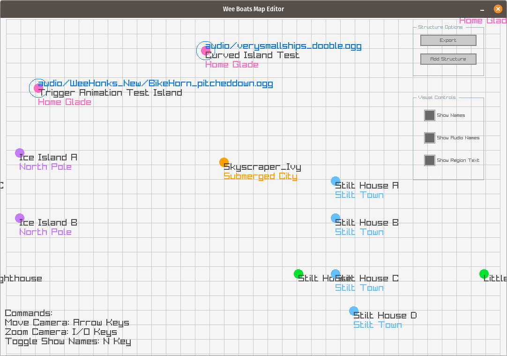

# Wee Boats Map Editor

- A map editor built for my game Wee Boats using Raylib.

## Builds Available
- Linux
- Windows
- MacOS

## Installation Guide

1. `git clone --recurse-submodules git@github.com:JamesGallagherPoole/MapEditor.git`
2. `cd MapEditor/src`
3. `make`
